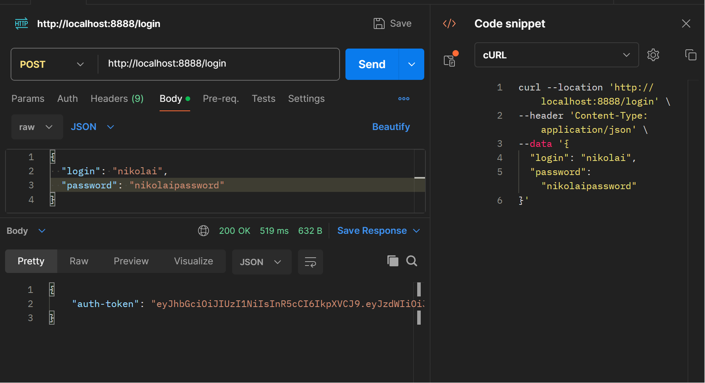

# Проект «Облачное хранилище»

Замечательной частью в данном проекте является BACKEND, который был написан мной на Java с использованием Spring Boot. Сервис предоставляет REST-интерфейс для менеджинга файлов и вывода списка уже загруженных файлов пользователя. Декомпозирован на слои в стиле MVC, комплиментарен FRONTENDу (заранее подготовленное веб-приложение (папка front)). Доступен по адресу http://localhost:8888.

 Файл 'src\main\java\com\Nickode\configuration\NiCloudConfigurationForFrontend.java' отвечает за настойку CORS (см. ниже).
 Крепость настойки позволяет FRONTENDу обращаться к BACKENDу вместо использования Postman или обычного браузера.

## Приложение удовлетворяет следующим требованиям:

- Сервис предоставляет REST-интерфейс для интеграции с FRONT (к нему приложен файл спецификации (./specification/CloudServiceSpecification.yaml). Фронт может запускаться через докер. Для этого есть файл frontendContainer.yaml. FRONT доступен по адресу http://localhost:8080).

- BACKEND реализует авторизацию (о ней отдельно ниже), добавление файла (uploadFile(...)) в базу данных (о ней также отдельно ниже), удаление файла (deleteFile(...)) из базы данных, скачивание файла (downloadFile(...)) из базы данных, изменение имени файла (editFileName(...)), получение списка всех файлов (getFileNames(...)).

- Информация о пользователях сервиса (логины для авторизации) и данные хранятся в базе данных. Она запускается в контейнере с помощью файла mySQLcontainer.yaml, заполняется с помощью liquibase, которая реализует миграции. BD доступна по адресу http://localhost:3333

- Приложение разработано с использованием Spring Boot.

- Использован сборщик пакетов maven.

- Для запуска используется docker, docker-compose.

- Код покрыт unit-тестами с использованием mockito.

- Есть интеграционный тест с использованием testcontainers.

## Авторизация
Все запросы к сервису здесь авторизованы.
FRONT-приложение использует header auth-token, в котором отправляет токен для идентификации пользователя на BACKEND. Для получения токена нужно пройти авторизацию на BACKEND и отправить на метод /login логин и пароль. В случае успешной проверки в ответ BACKEND возвращает json-объект с полем auth-token и значением токена. Все дальейшие запросы с FRONTEND, кроме метода /login, отправляются с этим header. Для выхода из приложения нужно вызвать метод BACKEND /logout, который удалит/добавит в черный список токен. Здесь реализован наиболее популярный способ авторизации для Spring Boot приложений - библиотека org.springframework.security. Использован  JSON Web Token (JWT), для его менеджинга использована библиотека com.auth0. Фильтр NiCloudOncePerRequestFilter — должен передать токен из запроса менеджеру аутентификации authenticationManager.
Токен генерируется сервером, отправляется клиенту и затем у него и хранится. А на стороне сервера хранятся ключ и данные пользователя. Запросы клиента серверу после генерации токена приходят с этим самым сгенерированным токеном в хедере auth-token. Токен верифицируется (о верификации ниже), и запрос удовлетворяется. 


Как происходит верификация:
Есть NiCloudOncePerRequestFilter, “в нём” извлекается токен: requestHeader = request.getHeader(“auth-token”), также в NiCloudOncePerRequestFilter есть метод doFilterInternal. Внутри него вызывается niCloudJSONwebTokenManager.getAuthentication(token). Внутри метода getAuthentication происходит верификация verifier.verify(token).getSubjec(). Он возвращает из payload токена имя пользователя. Вернуть он его может, так как this.verifier = JWT.require(this.algorithm).build() и this.algorithm = Algorithm.HMAC256(jwtSecret), где jwtSecret - это jwt.secret в файле application.properties, являющийся ключом. Таким образом, если у пользователя из токена из header из запроса есть роль ROLE_USER, а над соответствующим методом в NiCloudController есть аннотация @RolesAllowed({“ROLE_USER”}), то данный запрос удовлетворяется.
## Логгирование
Логгирование осуществляется с помощью java.util.logging. Лог ведётся одновременно в консоль и в файл.

## Инструкция по запуску фронта (фронт запускается через докер, файл - frontendContainer.yaml)
1. Установите nodejs (версия не ниже 19.7.0) на компьютер, следуя [инструкции](https://nodejs.org/ru/download/current/).
2. Скачайте [FRONT](./netology-diplom-frontend) (JavaScript).
3. Перейдите в папку FRONT приложения и все команды для запуска выполняйте из неё.
4. Следуя описанию README.md FRONT проекта, запустите nodejs-приложение (`npm install`, `npm run serve`).
5. Далее нужно задать url для вызова своего backend-сервиса.
    1. В файле `.env` FRONT (находится в корне проекта) приложения нужно изменить url до backend, например: `VUE_APP_BASE_URL=http://localhost:8080`. 
       1. Нужно указать корневой url вашего backend, к нему frontend будет добавлять все пути согласно спецификации
       2. Для `VUE_APP_BASE_URL=http://localhost:8080` при выполнении логина frontend вызовет `http://localhost:8080/login`
    2. Запустите FRONT снова: `npm run serve`.
    3. Изменённый `url` сохранится для следующих запусков.
6. По умолчанию FRONT запускается на порту 8080 и доступен по url в браузере `http://localhost:8080`. 
   1. Если порт 8080 занят, FRONT займёт следующий доступный (`8081`). После выполнения `npm run serve` в терминале вы увидите, на каком порту он запустился.

## Настройка CORS

Чтобы FRONT смог обратиться к серверу: 
```java
import org.springframework.context.annotation.Configuration;
import org.springframework.web.servlet.config.annotation.CorsRegistry;
import org.springframework.web.servlet.config.annotation.EnableWebMvc;
import org.springframework.web.servlet.config.annotation.WebMvcConfigurer;

@Configuration
@EnableWebMvc
class NiCloudConfigurationForFrontend implements WebMvcConfigurer {

    @Override
    public void addCorsMappings(CorsRegistry registry) {
        registry.addMapping("/**")
            .allowCredentials(true)
            .allowedOrigins("http://localhost:8080")
            .allowedMethods("*");
    }
}
